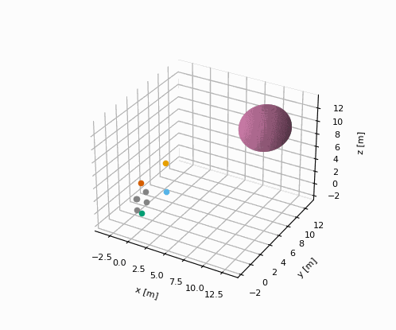
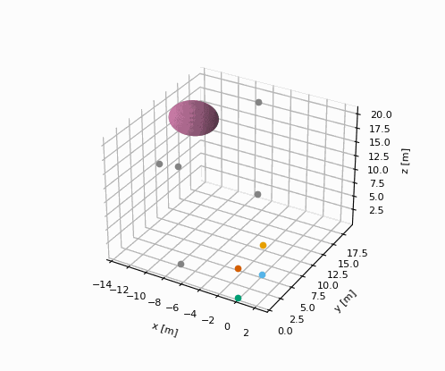

AI Formation Planning
========================

## Overview

This software generates collision free trajectories for a hemispherical formation of drones tasked with flying toward and covering a target.

## Installation

```bash
git clone https://github.com/jasminium/formationplanning.git
cd formationplanning
python setup.py install
```

## Running the Examples

```bash
python formationplanning/examples/d.py
python formationplanning/examples/e.py
```

## Examples

The following examples show the simulated physics based trajectories of 3d particles following the trajectories generated by the software.

1. The hemisphere tracks toward a target.


2. The hemisphere tracks toward a target which is located in the opposite direction to its initial position. The hemisphere manoeuver intelligently to increase the coverage of the target.


3. The formation is initially small in comparison to the target. It rescales itself and tracks toward the target



4. The formation is initially large in comparison to the target. It rescales itself and tracks toward the target.



## How it Works

The formation plans its trajectory intelligently by measuring the sum or flux of an electric field across its surface which is generated by the target. By increasing the flux the formation can locate and move toward the target. Collisions are avoided since a reduction in the surface area of the formation reduces the flux.

This solution is efficient since only the 4 drones on the front face shown in colour are required to calculate the flux across the entire surface of the formation. Therefore many followers can be added without increasing the dimensionality of the problem. Also the solution does not require training data and makes optimal choices directly.

The formation retains its shape throughout the simulation - this is advantageous for scenarios where the drones should maintain an optimal coverage of the target.

Once the paths are obtained they are parameterized and subjected to performance constraints, velocity and acceleration, using time-optimal path parameterization. The planned trajectories are smooth enough to use for robotic control.
